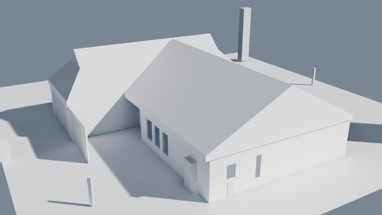

<h1 align="center">Pascal Scene Importer for Blender</h1>

<p align="center">
  Open your <a href="https://editor.pascal.app">Pascal editor</a> scenes in Blender —
  drag &amp; drop, fully editable, zero data loss.
</p>

<p align="center">
  <a href="https://github.com/pascalorg/pascal-blender/releases/latest"></a>
  <a href="https://github.com/pascalorg/pascal-blender/releases"></a>
  <a href="https://github.com/pascalorg/pascal-blender/actions/workflows/ci.yml"></a>
  
  
</p>

<p align="center">
  
</p>

The Pascal editor stores everything as a parametric JSON scene graph — walls,
slabs, roofs, doors, windows, furniture, trees. Its GLB export bakes all of
that into a triangle soup. **This extension consumes the scene JSON instead**
and rebuilds the model as native, editable Blender data, while keeping every
byte of the original file recoverable from the `.blend`.

## Install (30 seconds)

1. **[Download the latest zip →](https://github.com/pascalorg/pascal-blender/releases/latest)**
2. Drag the zip into any Blender 4.2+ window → click **Install**
3. `File → Import → Pascal Scene (.json)` — or drag a scene `.json` straight into the 3D viewport

Or use the one-click link (drag it into Blender; it also offers to subscribe
you to updates):
[Install pascal_blender](https://github.com/pascalorg/pascal-blender/releases/download/v0.2.0/pascal_blender-0.2.0.zip?repository=https%3A%2F%2Fpascalorg.github.io%2Fpascal-blender%2Findex.json&blender_version_min=4.2.0)

**Auto-updates:** in Preferences → Get Extensions → Repositories → **+** →
*Add Remote Repository* enter

```
https://pascalorg.github.io/pascal-blender/index.json
```

Blender will then offer updates for this extension like any official one.

No Pascal account? Try the bundled sample: [`examples/demo-house.json`](examples/demo-house.json).

## What you get

| | Pascal GLB export | **This importer** |
|---|---|---|
| Walls | baked triangles | objects with `start/end/thickness/height`, mitered corners |
| Doors & windows | holes frozen into the mesh | live objects — **move a door, its opening follows** (boolean modifiers) |
| Roofs | baked | 7 parametric types rebuilt from their parameters |
| Floors/levels | one flat hierarchy | `Site → Building → Level` collections, origin Empty per storey |
| Furniture | duplicated meshes | instanced collections (one GLB, N instances) |
| Materials | baked approximations | deduplicated `Pascal/*` Principled BSDF materials from the preset table |
| Your data | **gone** | every node's JSON in custom properties + the full source file in a Text datablock |

**Zero data loss, proven in CI:** the test suite rebuilds the complete
original JSON from the `.blend` alone and asserts it is deep-equal to the
source file — including unknown node types, plugin nodes, orphans, and fields
this version has never heard of. Forward-compatible by construction.

## Getting the JSON out of the Pascal editor

Use the editor's scene download (layout JSON), or run this in the browser
console on editor.pascal.app:

```js
const s = localStorage.getItem('pascal-editor-scene');
const a = document.createElement('a');
a.href = URL.createObjectURL(new Blob([s], {type: 'application/json'}));
a.download = 'scene.pascal.json';
a.click();
```

## Import options

| Option | Default | Meaning |
|---|---|---|
| Download assets | on | fetch furniture GLBs (cached); off = labeled wire placeholders |
| Bake openings | off | apply wall booleans instead of keeping live modifiers |
| Physical glass | off | add Transmission/IOR for real refraction in Cycles |
| Apply texture field | on | honor `material.texture` as an image texture |
| Asset CDN | editor.pascal.app | base URL for relative asset paths |
| Watts per light unit | 60 | calibration for the editor's light intensities |

Defaults are configurable in the add-on preferences.

## How losslessness works

| Where | What |
|---|---|
| Text datablock `pascal_source.json` | the complete original file, pretty-printed |
| Scene props | sha256 of the original bytes, root ids, unknown top-level keys |
| Every object: `pascal_id`, `pascal_type`, `pascal_json` | node identity + its verbatim JSON |
| `pascal_params` | readable mirror of the geometry-driving fields (N-panel → Pascal tab) |

An exporter (Blender edits → back to Pascal JSON) is designed and on the
roadmap; the no-edit round-trip is already enforced by CI.

## Development

```sh
# pure-python core tests (no Blender needed)
python3 tests/test_openings.py && python3 tests/test_wallnet.py

# full headless suite: import every fixture, prove losslessness, save/reload
/Applications/Blender.app/Contents/MacOS/Blender --background --factory-startup \
    --python tests/run_headless.py
```

See [`TESTING.md`](TESTING.md), the design doc
[`docs/design/lossless-mapping.md`](docs/design/lossless-mapping.md), and the
reimplementation specs in [`docs/spec/`](docs/spec/) extracted from the
editor's geometry code.

## Known limitations

- `asset://…` URLs (blobs in the authoring browser) import as placeholders.
- Roof geometry is a solid envelope matching the editor's silhouette; the
  exact hollow-shell CSG is specced (`docs/spec/03-roofs.md`) for a future release.
- Blender→Pascal export not yet implemented (design ready).

MIT — see [LICENSE](LICENSE). The Pascal editor is also open source:
[pascalorg/editor](https://github.com/pascalorg/editor).
